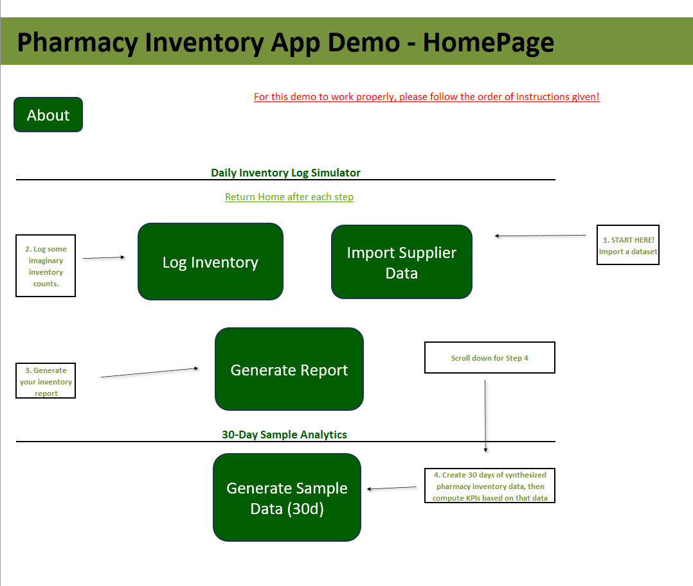
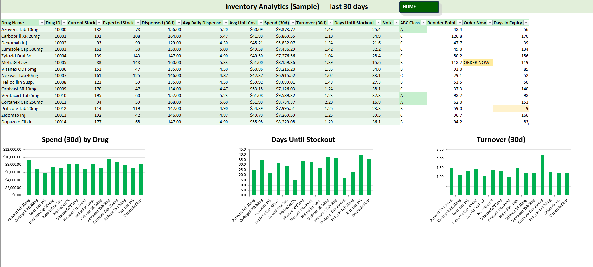
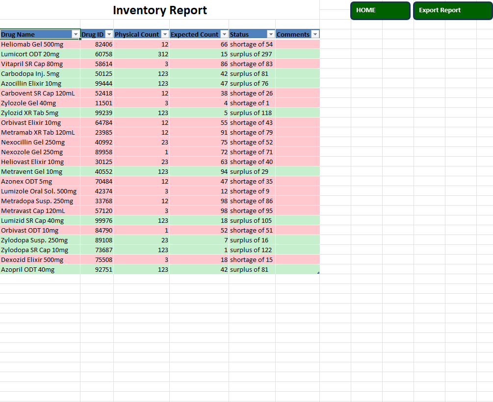

# Pharmacy Inventory Analytics (Demo)

An **interactive Excel VBA application** that simulates a pharmacy inventory management workflow.  
This project is a **demo version** of a real solution I built during my time at an IDHS clinical pharmacy.  
It uses **synthetic data** only (no patient or clinical data) but showcases the **automation, analytics, and UI concepts** from the original.

---

##  Background

During an observership experience at an IDHS clinical pharmacy, I observed technicians spending **hours weekly** on repetitive tasks:

- Manually **counting inventory** on paper
- Cross-checking counts with weekly email reports
- Doing the math by hand to find **shortages, surpluses, and balances**
- Juggling multiple sheets with different formats (some with canister numbers to help with locating each drug, others without these canister numbers)

The biggest pain point: the sheet with canister numbers existed only as a **PDF image**, making it hard to merge with the weekly reports.

---

##  Original Solution (clinical, not shareable)

To solve this, I built a secure Excel-based app that:

1. **Extracted data** from scanned PDFs using **Amazon Textract**
2. **Standardized drug names** with fuzzy string matching (Python + FuzzyWuzzy)
3. **Linked canister numbers** to weekly reports automatically
4. Built an **interactive Excel app** with:
   - One-click **weekly import**  
   - Technician input for physical counts  
   - Automated **report generation** (shortages/surpluses)  
   - Clean navigation (like an app, but in Excel)  
   - Print-ready inventory reports

 Due to clinical confidentiality, I cannot share that original workbook or data.

---

##  Demo Version (what’s here)

This repo provides a **demo** with safe sample data, to showcase the concepts:

- **Generate Sample Data (30d)** → creates synthetic drug inventory + dispense logs
- **Build Analytics** → produces a full analytics dashboard:
  - ABC Classification (A/B/C items ranked by spend)
  - Reorder Point & “Order Now” alerts
  - Turnover ratio & Days-to-Expiry
- **Dynamic Charts**:
  - Spend by Drug
  - Days Until Stockout
  - Turnover
- **UI polish**:
  - Auto-hide sheets (only “Home” and “About” visible by default)
   - Launcher buttons for easy navigation

---

##  Screenshots

  
*Navigation buttons and clean UI*

  
*Calculated KPIs with reorder alerts, expiry tracking, and charts*

  
*Print-ready daily inventory report*

---

## Tech Stack

- **Advanced Excel** (VBA macros, dynamic charts, Excel UI customization)
- **Python (original project only)** for text extraction and fuzzy matching
- **Amazon Textract (original project only)** for PDF table extraction

---

## Significance

This project shows how **Excel can evolve into a lightweight ERP tool** with:

- Data ingestion
- Automation
- Standardization
- Analytics
- Visualization
- User-friendly navigation

Even without dedicated pharmacy inventory software, I was able to **reduce inventory reporting time by ~40% in a real pharmacy setting**.

---

## How to Use (Demo) - Instructions are also inside "About" Page in Workbook

1. Enable macros in Excel
2. Open `DemoWorkbook.xlsm`
3. On the **Home** sheet, click **Generate Sample Data (30d)**
4. Then click **Build Analytics**
5. Explore the automatically generated **Sample Analytics** dashboard

---

## 👤 Author

**Daryl Okeke**  
  Molecular & Cellular Biology major • Data Science Minor @ UIUC
  Email Address: [dokeke2004@gmail.com](mailto:dokeke2004@gmail.com)

